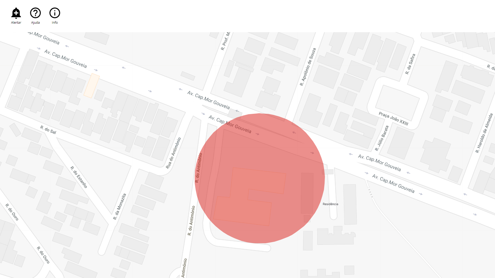

## Dease
### Dease is a web based app which aim an effective reduction on the rapid spread of infectious disease aka. epidemic.

This project uses: Js (Javascript), Php (Hypertext Preprocessor), HTML (HyperText Markup Language), CSS (Cascading Style Sheets) and Google Maps API.

The app basically renders a map centered at the user's current location, and draws the risk areas based on the data of the database. The user is able to report the indication of a disease or a epidemic and then, the data is sent to the database. Unless an occurence has 3 or more reports, nothing is displayed, but for any value higher than that, a red circle is shown on the map. Any report of the same disease in the risk area of an existing occurence or close enough to it to be considered originated from the same disease focus updates the existing one instead of creating another. Any user (device) is only able to create or update an occurence once in 24 hours to prevent spam.

There are lots of thing I would like to implement/improve/change in this project, like using node.js, but for now, for a prototype it's working.  

This system provides data that could be so precious to fight epidemics. The user is able to know the risks in the area and the government could have a potential tool to mine data and spend health dedicated money more precisely and effectively.

I decided to put this project under Apache License. Feel free to distribute or change this code, but also care for helping me to improve this project.

It's necessary to create the correct data structure on the database, import the .sql file in .core/sql/ to automatically create the tables the app needs to work.

allowspam is a boolean that define whether is ok to interact with the database (create or update an occurence) more than once in 24 hours from the same device.

![piece of code][allowspam]

in Index.php replace YOUR_API_KEY with your unique Google Maps API Key:

```html
<script async defer
    src = "https://maps.googleapis.com/maps/api/js?key=YOUR_API_KEY&callback=initMap">
</script>
```
I've built this prototype, but I'm not a Front-End developer and my experience with web (html, php, css and js) is so, so small. Feel free to comment or suggest anything. If you want to improve this project in any way, please contact me and please don't curse me for any mistake =).

### Dease é um aplicativo baseado na web que visa uma redução eficaz na propagação de doenças infecto contagiosas, também conhecida como epidemia.

Esse projeto usa: Js (Javascript), Php (Hypertext Preprocessor), HTML (HyperText Markup Language), CSS (Cascading Style Sheets) e Google Maps API.

O aplicativo basicamente renderiza um mapa centrado na localização atual do usuário e desenha as áreas de risco com base nos dados do banco de dados. O usuário é capaz de relatar a indicação de uma doença ou uma epidemia e em seguida, os dados são enviados para o banco de dados. A menos que uma ocorrência tenha 3 ou mais relatos, nada é exibido, mas para qualquer valor maior que isso, um círculo vermelho é mostrado no mapa. Qualquer relato da mesma doença na área de risco de uma ocorrência existente ou próximo o suficiente para ser considerado originado do mesmo foco de doença atualiza a existente em vez de criar outra. Qualquer usuário (dispositivo) só pode criar ou atualizar uma ocorrência uma vez em 24 horas para evitar spam.

Há muitas coisas que eu gostaria de implementar/melhorar/mudar nesse projeto, como usar node.js, mas por enquanto, para um protótipo, está funcionando.

Eu decidi colocar este projeto sob licença Apache. Sinta-se livre para distribuir ou alterar este código, mas também me ajude a melhorar este projeto.

Este sistema fornece dados que poderiam ser muito preciosos para combater epidemias. O usuário é capaz de conhecer os riscos na área e o governo teria uma ferramenta potencial para minerar dados e gastar dinheiro dedicado à saúde de forma mais precisa e eficaz.

É necessário criar no banco de dados as estruturas corretas, importe o arquivo .sql do projeto em .core/sql/ para criar as tabelas necessárias para o funcionamento do app.

allowspam é um booleano que define quando é ok interagir com o banco de dados (criar ou atualizar uma ocorrência) mais de uma vez em 24 horas.

![trecho de código][allowspam]

em Index.php substitua YOUR_API_KEY com a sua propria chave do Google Maps API:

```html
<script async defer
    src = "https://maps.googleapis.com/maps/api/js?key=YOUR_API_KEY&callback=initMap">
</script>
```

Fiz esse protótipo, mas não sou desenvolvedor Front-End e minha experiência com web (html, php, css e js) é muito, muito pequena. Sinta-se à vontade para comentar ou fazer qualquer sugestão. Se você quiser melhorar esse projeto em qualquer aspecto, entre em contato comigo e por favor não me xingue por qualquer erro cometido =).

### Laptop/Desktop Preview

![Laptop/Desktop Preview][laptop]

### Demo (click the image below / clique na imagem abaixo)

[](https://www.youtube.com/watch?v=4PLlOR78ifU)
[or use this link / ou use este link](https://www.youtube.com/watch?v=4PLlOR78ifU)

I used [Manual Geolocation](https://chrome.google.com/webstore/detail/manual-geolocation/jpiefjlgcjmciajdcinaejedejjfjgki) for privacy and proof of concept: 

Locations used / Localizações usadas: 

[-5.8321357, -35.205316700000026], [-5.831512, -35.204181000000005], [-5.831872, -35.20487300000002];

### Database Preview

The occurrences table looks like this / A tabela de ocorrências é assim:

![alt-text][occurrences]

The field Id has a unique number do identify each occurrence, Disease is self-explanatory, Lat and Lng are the coordinates of the center the risk area, Reports has the number that indicates how many times that disease was reported by an user and updated that occurrence, Created and Updated are self-explanatory unix timestamps.

O campo Id tem um número único para identificar cada ocorrência, Disease é auto-explicativa em inglês e significa doença, Lat e Lng são as coordenadas do centro da área de risco, Reports tem o número que indica quantas vezes essa doença foi relatada por um usuário e atualizou essa ocorrência, Created e Updated são timestamps unix auto-explicativas.

The interactions table looks like this / A tabela de interações é assim:

![alt-text][interactions]

The field Id has a unique number do identify each interaction, Ip has the ip address of the device that made that interaction, Tstamp is a unix timestamp that stores the moment (date / hour / minute / second) of that interaction, Type indicates what kind of interaction was made and finally Occurrence indicates what occurrence was created or updated by that interaction. 

O campo Id tem um número único para identificar cada interação, Ip tem o endereço IP do dispositivo que fez aquela interação, Tstamp é um timestamp unix que armazena o momento (data / hora / minuto / segundo) dessa interação, Type indica o que tipo de interação foi feita e por fim Occurrence indica que ocorrência foi criada ou atualizada por essa interação.

### Smartphone Preview

![Smartphone Preview][smartphone]

[smartphone]: readme/smartphone.gif "What looks like in a Smartphone."
[tablet]: readme/tablet.gif "What looks like in a Tablet."
[laptop]: readme/laptop.gif "What looks like in a Laptop/Desktop."
[allowspam]: readme/allowspam.png "Piece of code that enable/disable spam protection."
[interactions]: readme/interactions.png "What looks like the interactions table on the database."
[occurrences]: readme/occurrences.png "What looks like the occurrences table on the database."
[laptop]: readme/laptop.gif "What looks like in a Laptop/Desktop."